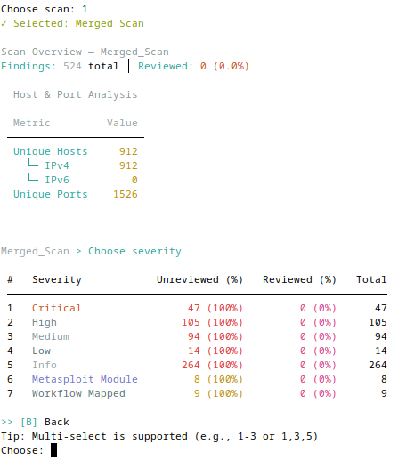
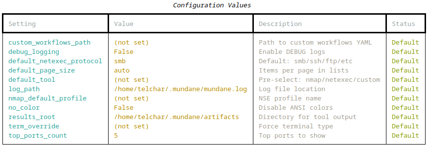
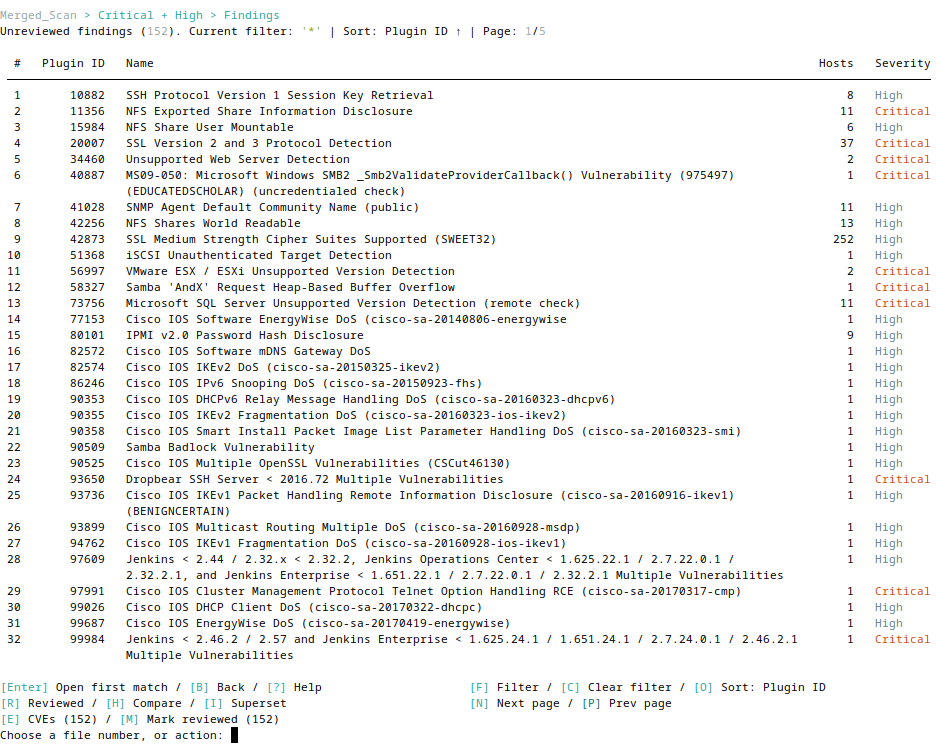
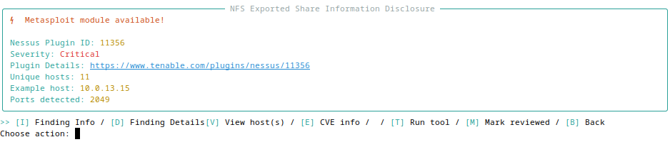
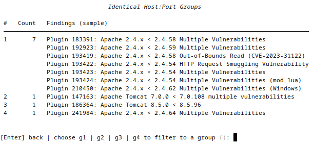
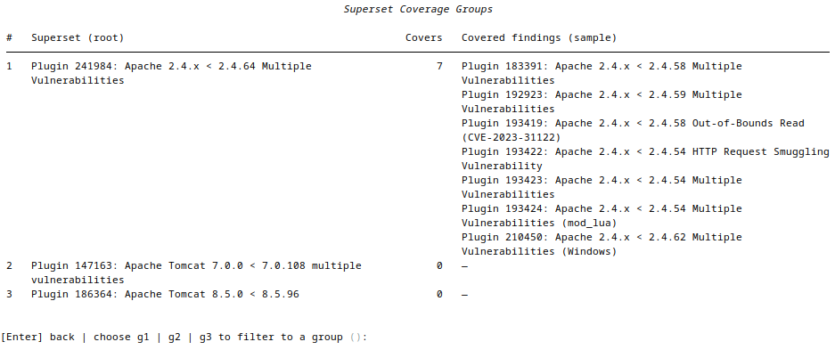
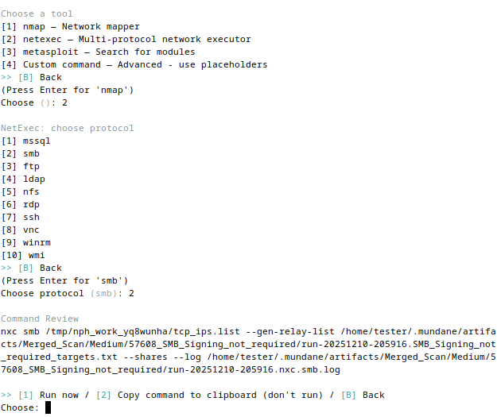
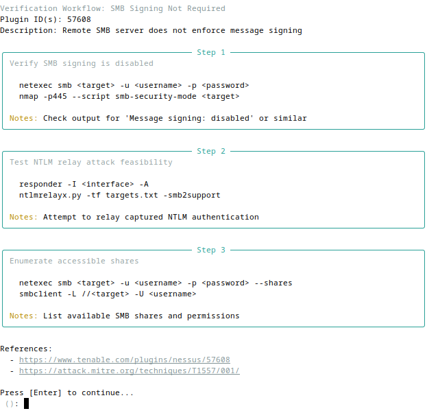

# Mundane

A **TUI tool** for reviewing Nessus scan findings and orchestrating security tools (**nmap**, **NetExec**, custom commands). Import `.nessus` files into a SQLite database for organized, persistent vulnerability verification and exploitation.

**Key capabilities:**
- 🔍 Interactive TUI for browsing/reviewing vulnerability findings
- 💾 SQLite-backed persistence (cross-scan tracking, session resume)
- ⚡ One-command tool launches (nmap NSE scripts, NetExec, custom workflows)
- 📊 CVE extraction, Metasploit module search, host comparison

---

## Quick Start

```bash
# Install with pipx (recommended)
pipx install git+https://github.com/ridgebackinfosec/mundane.git

# Import a Nessus scan
mundane import nessus scan.nessus

# Review findings interactively
mundane review
```

**That's it!** See [Common Commands](#commands) for more.

<p align="center">
  
  <br>
  <em>Start your review with an overview of findings by severity level</em>
</p>

---

## Installation

**Recommended (pipx):**
```bash
pipx install git+https://github.com/ridgebackinfosec/mundane.git
mundane --help
```

**Alternative (pip):**
```bash
pip install git+https://github.com/ridgebackinfosec/mundane.git
```

**Development:**
```bash
git clone https://github.com/ridgebackinfosec/mundane.git
cd mundane
pip install -e .
```

**Shell completion:**
```bash
mundane --install-completion  # Enable tab completion for your shell
```

**Upgrading from v1.x:** v2.0 introduced breaking schema changes. Delete old database and re-import scans. See [docs/DATABASE.md](docs/DATABASE.md).

---

## Requirements

- **Python 3.11+**
- **Optional tools:** `nmap`, `nxc`/`netexec`, `msfconsole` (only if you use them)
- **Linux recommended** (clipboard tools: `xclip`, `xsel`, or `wl-copy`)

---

## Configuration

**Configuration file** (`~/.mundane/config.yaml`):

Auto-created with defaults on first run. All settings managed via config file.

```bash
mundane config show        # View all settings with current values
mundane config set <key> <value>  # Change a setting
mundane config reset       # Reset to defaults (creates backup)
```

<p align="center">
  
  <br>
  <em>Browse findings with paged tables and comprehensive keyboard shortcuts</em>
</p>

---

## Features

### 🔍 Interactive TUI for browsing/reviewing vulnerability findings

Rich tables with paged views, keyboard-driven navigation, and real-time filtering.

<p align="center">
  
  <br>
  <em>Browse findings with paged tables and comprehensive keyboard shortcuts</em>
</p>

**Key capabilities:**
- Browse by severity, preview plugin details, clipboard copy
- Grouped view (`host:port,port`) or raw file view
- Multi-select operations, reversible review states

---

### 📊 Intelligence & Research

Extract CVEs, search Metasploit modules, and compare findings across hosts.

<p align="center">
  
  <br>
  <em>View plugin details with Metasploit module availability and metadata</em>
</p>

**Features:**
- **CVE extraction** - CVEs imported from .nessus file (press `[E]`)
- **Metasploit search** - Find relevant modules by CVE/description
- **Workflow mappings** - Plugin-specific verification/exploitation steps (press `[W]`)
- **Host comparison** - Compare findings across hosts to find identical combinations and superset relationships

<p align="center">
  
  <br>
  <em>Compare findings to identify identical host:port combinations across plugins</em>
</p>

<p align="center">
  
  <br>
  <em>Analyze superset relationships to find which findings cover others</em>
</p>

---

### ⚡ One-command tool launches

Launch nmap NSE scripts, NetExec, Metasploit, or custom commands with placeholder substitution.

<p align="center">
  
  <br>
  <em>Select tools and review generated commands before execution</em>
</p>

**Features:**
- Launch **nmap** (NSE profiles, UDP), **NetExec**, or custom commands
- Placeholder substitution for flexible templating
- Execution logging & artifact tracking

---

### 💾 SQLite-backed persistence

**Session Management:**
- Auto-save/resume interrupted reviews
- Reversible review-complete (undo with `[U]`)
- Session statistics (duration, per-severity breakdown)

**Database:** SQLite-backed persistence at `~/.mundane/mundane.db` tracks scans, findings, sessions, tool executions, and artifacts. Cross-scan tracking enables host history queries. See [docs/DATABASE.md](docs/DATABASE.md) for schema details.

---

## Commands

```bash
# Import and review
mundane import nessus <scan.nessus>
mundane review [--custom-workflows PATH]

# Manage scans
mundane scan list
mundane scan delete <scan_name>

# Configuration
mundane config show | reset | get <key> | set <key> <value>
```

---

## Custom Workflows

Add plugin-specific verification workflows with `--custom-workflows` (merges & supplements with defaults) or `--custom-workflows-only` (replaces defaults):

```bash
mundane review --custom-workflows my_workflows.yaml
```

**Example workflow YAML:**
```yaml
version: "1.0"
workflows:
  - plugin_id: "57608"
    workflow_name: "SMB Signing Not Required"
    steps:
      - title: "Verify SMB signing"
        commands: ["netexec smb <target> -u <user> -p <pass>"]
```

**Custom command placeholders:** `{TCP_IPS}`, `{UDP_IPS}`, `{TCP_HOST_PORTS}`, `{PORTS}`, `{WORKDIR}`, `{RESULTS_DIR}`, `{OABASE}`

<p align="center">
  
  <br>
  <em>View plugin-specific verification workflows with commands and references</em>
</p>

---

## Documentation

- [Database schema & queries](docs/DATABASE.md)
- [Adding custom tools](docs/ADDING_TOOLS_QUICKSTART.md)
- [Tool system guide](docs/TOOL_SYSTEM_GUIDE.md)
- [Error handling](docs/ERROR_HANDLING.md)

---

## License

This tool orchestrates local utilities and includes Nessus XML parsing functionality adapted from
[DefensiveOrigins/NessusPluginHosts](https://github.com/DefensiveOrigins/NessusPluginHosts).
Respect all dependencies' licenses and your organization's policies.
