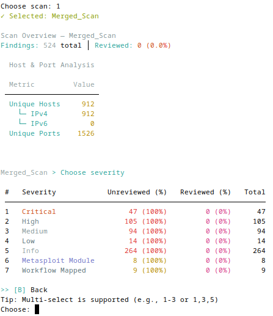
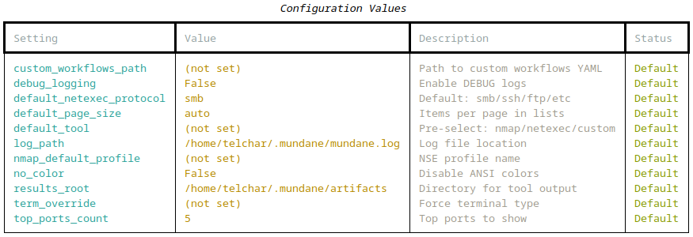
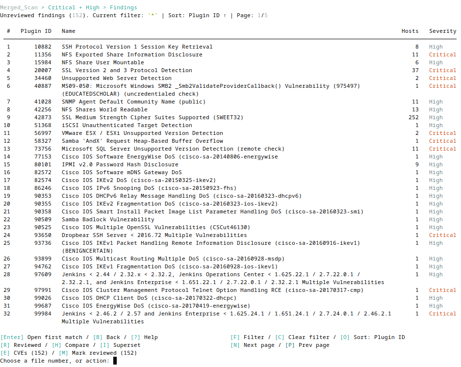
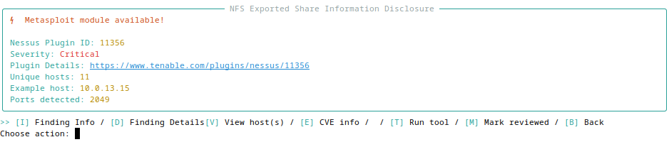
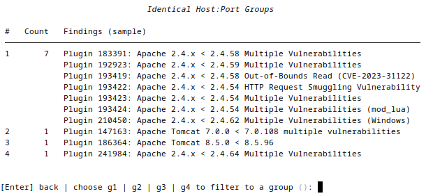
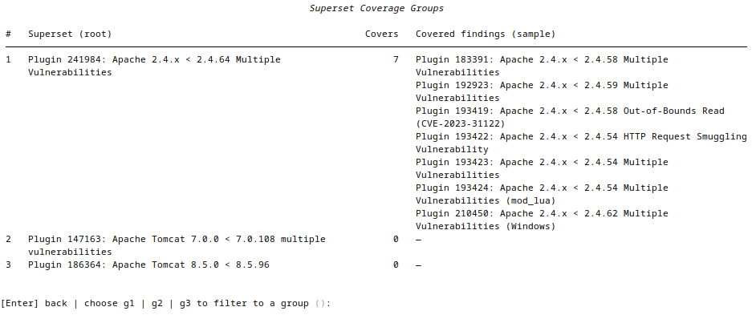
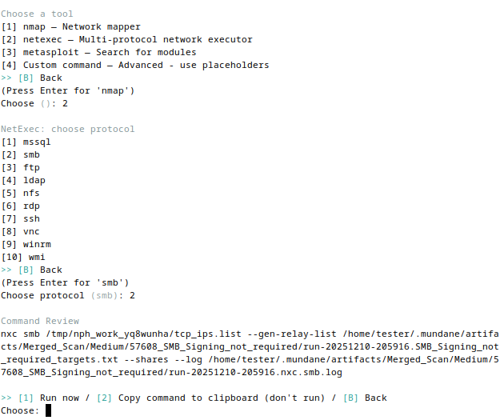
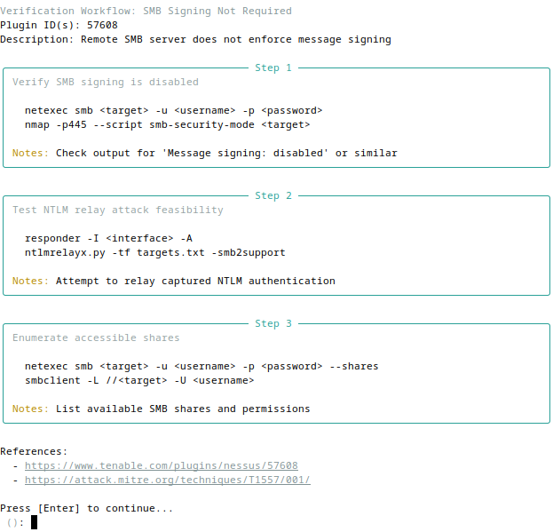

# Cerno

A **TUI tool** for reviewing Nessus scan findings and orchestrating security tools (**nmap**, **NetExec**, custom commands). Import `.nessus` files into a SQLite database for organized, persistent vulnerability verification and exploitation.

**Key capabilities:**
- 🔍 Interactive TUI for browsing/reviewing vulnerability findings
- 💾 SQLite-backed persistence (cross-scan tracking, session resume)
- ⚡ One-command tool launches (nmap NSE scripts, NetExec, custom workflows)
- 📊 CVE extraction, Metasploit module search, host comparison
- 🔗 NetExec database integration (correlate credentials with findings)
- 🤖 Claude Assistant (BETA) — on-demand AI chat at finding, severity, and findings-list scope
- 🔀 Proxychains4 integration — route all tool executions through a SOCKS5 proxy

**📺 Watch the demo:**

<a href="https://www.youtube.com/watch?v=aGmRenQ28Ro">
  
</a>

---

## Quick Start

```bash
# Install with pipx (recommended)
pipx install git+https://github.com/ridgebackinfosec/cerno.git

# Import a Nessus scan
cerno import nessus scan.nessus

# Review findings interactively
cerno review
```

**That's it!** See [Common Commands](#commands) for more.

<p align="center">
  
  <br>
  <em>Start your review with an overview of findings by severity level</em>
</p>

---

## About the Name

**Cerno** comes from the Latin verb *cernō*, meaning:
- To discern, distinguish, perceive
- To separate, sift through
- To decide, determine, resolve

The name reflects this tool's core purpose: **to help security professionals discern what matters** in large vulnerability scans. Just as *cernō* means to sift through and distinguish the important from the noise, Cerno helps you:

- **Discern** which findings require immediate action vs. can be deferred
- **Separate** findings by severity, host, and exploitability
- **Perceive** patterns across hosts and identify verification paths
- **Determine** the most efficient approach to vulnerability validation
- **Resolve** findings through organized, tracked remediation workflows

In penetration testing and vulnerability management, clarity through careful examination is essential—that's Cerno.


**Pronunciation:** In Classical Latin, *cerno* is pronounced **KEHR-noh** (IPA: [ˈkɛr.noː])—the 'c' as a hard 'k' sound, the 'e' as in 'bed', and the 'o' as in 'no' (long). [Audio sample](https://www.howtopronounce.com/latin/cerno)

---

## Installation

**Requirements:** Python 3.11+ on Linux, macOS, or Windows.

**Recommended (pipx):**
```bash
pipx install git+https://github.com/ridgebackinfosec/cerno.git
cerno --help
```

**Alternative (pip):**
```bash
pip install git+https://github.com/ridgebackinfosec/cerno.git
```

**Development:**
```bash
git clone https://github.com/ridgebackinfosec/cerno.git
cd cerno
pip install -e .
```

**Shell completion:**
```bash
cerno --install-completion  # Enable tab completion for your shell
```

---

## Releases

Cerno uses **automated releases** triggered by version changes in [pyproject.toml](pyproject.toml).

**How it works:**
- When `pyproject.toml` version is updated and merged to `main`, GitHub Actions automatically:
  - Creates a git tag (e.g., `v1.0.1`)
  - Generates a GitHub Release marked as "latest"
  - Extracts release notes from [CHANGELOG.md](CHANGELOG.md)
  - Attaches built wheel and source distribution

**View releases:** [github.com/ridgebackinfosec/cerno/releases](https://github.com/ridgebackinfosec/cerno/releases)

**For contributors:** To create a new release, update the version in `pyproject.toml` and add an entry to `CHANGELOG.md` following [Keep a Changelog](https://keepachangelog.com/) format. The release workflow runs automatically when changes are merged to `main`.

---

## Requirements

- **Python 3.11+**
- **Optional tools:** `nmap`, `nxc`/`netexec`, `msfconsole`, `claude` (only if you use them)
- **Linux recommended** (clipboard tools: `xclip`, `xsel`, or `wl-copy`)

---

## Configuration

**Configuration file** (`~/.cerno/config.yaml`):

Auto-created with defaults on first run. All settings managed via config file.

```bash
cerno config show                    # View all settings with current values
cerno config get <key>               # Get a single config value
cerno config set <key> <value>       # Change a setting
cerno config reset                   # Reset to defaults (creates backup)
```

**Proxychains4 proxy settings:**
```bash
cerno config set proxychains_enabled true        # Enable proxy routing (default: false)
cerno config set proxychains_host 127.0.0.1      # SOCKS5 proxy host
cerno config set proxychains_port 9000           # SOCKS5 proxy port (matches ssh -D default)
```

<p align="center">
  
  <br>
  <em>Show all configuration values using "cerno config show"</em>
</p>

---

## Features

### 🔍 Interactive TUI for browsing/reviewing vulnerability findings

Rich tables with paged views, keyboard-driven navigation, and real-time filtering.

<p align="center">
  
  <br>
  <em>Browse findings with paged tables and comprehensive keyboard shortcuts</em>
</p>

**Key capabilities:**
- Browse by severity, preview plugin details, clipboard copy
- Grouped view (`host:port,port`) or raw file view
- Multi-select operations, reversible review states

---

### 📊 Intelligence & Research

Extract CVEs, search Metasploit modules, and compare findings across hosts.

<p align="center">
  
  <br>
  <em>View plugin details with Metasploit module availability and metadata</em>
</p>

**Features:**
- **CVE extraction** - CVEs imported from .nessus file (press `[E]`)
- **Metasploit search** - Find relevant modules by CVE/description
- **Workflow mappings** - Plugin-specific verification/exploitation steps (press `[W]`)
- **Host comparison** - Compare findings across hosts to find identical combinations and superset relationships

<p align="center">
  
  <br>
  <em>Compare findings to identify identical host:port combinations across plugins</em>
</p>

<p align="center">
  
  <br>
  <em>Analyze superset relationships to find which findings cover others</em>
</p>

---

### 🤖 Claude Assistant (BETA)

Ask Claude questions about findings without leaving the TUI. Powered by the `claude` CLI (`claude -p`) — no API key required, no data sent to external services beyond what `claude` itself handles.

**Three scopes:**
- **Finding level** — press `[A]` inside a finding detail view to discuss that specific plugin: CVEs, CVSS context, exploitability, verification steps
- **Severity menu** — press `[A]` at the severity selection screen to discuss all findings across the selected scan(s)
- **Findings list** — press `[A]` in the findings list footer to discuss the current set of findings (respects any active severity, name, or group filter)

**Conversation persistence:** History is saved per-scope in SQLite and resumed automatically on re-entry. Press `C` inside the chat to clear history for the current scope.

**Setup:**
```bash
# Install Claude Code CLI and authenticate (required)
npm install -g @anthropic-ai/claude-code   # or follow https://claude.ai/code
claude  # launches interactive setup — complete login before using this feature

# Disable if not wanted
cerno config set claude_assistant_enabled false
```

**Tool availability:** `[A]` is hidden when `claude` is not on PATH, you are not logged into Claude Code, or `claude_assistant_enabled` is `false`. It appears in the tool availability table on review startup alongside nmap/netexec/msfconsole.

> **Note:** This feature is in beta and requires an active Claude Code session on your machine. Responses may be inaccurate — always verify before acting on suggestions.

---

### 🔗 NetExec Database Integration (Beta)

Automatically enrich finding displays with data from your NetExec databases—see which credentials work on affected hosts, share access, and security misconfigurations.

**Features:**
- **Credential correlation** - Shows which NetExec-discovered credentials have access to affected hosts
- **Share access** - Displays SMB share read/write permissions across hosts
- **Security flags** - Highlights SMB signing disabled, Zerologon, PetitPotam vulnerabilities
- **Per-host breakdown** - Press `[N]` in finding view for detailed per-host NetExec context

**Configuration:**
```bash
# NetExec workspace auto-detected at ~/.nxc/workspaces/default/
cerno config set nxc_workspace_path ~/.nxc/workspaces/client_a  # Custom workspace
cerno config set nxc_enrichment_enabled false                    # Disable feature
```

**Supported protocols:** SMB, SSH, LDAP, MSSQL, RDP, WinRM, FTP, NFS, VNC, WMI

> **Note:** This feature is in beta. NetExec databases are read in read-only mode; Cerno never modifies them.

---

### ⚡ One-command tool launches

Launch nmap NSE scripts, NetExec, Metasploit, or custom commands with placeholder substitution.

<p align="center">
  
  <br>
  <em>Select tools and review generated commands before execution</em>
</p>

**Features:**
- Launch **nmap** (NSE profiles, UDP), **NetExec**, or custom commands
- Placeholder substitution for flexible templating
- Execution logging & artifact tracking

---

### 💾 SQLite-backed persistence

**Session Management:**
- Auto-save/resume interrupted reviews
- Reversible review-complete (undo with `[U]`)
- Session statistics (duration, per-severity breakdown)

**Database:** SQLite-backed persistence at `~/.cerno/cerno.db` tracks scans, findings, sessions, tool executions, and artifacts. Cross-scan tracking enables host history queries. See [docs/DATABASE.md](docs/DATABASE.md) for schema details.

---

### 🔀 Proxychains4 Integration

Route all tool executions (nmap, NetExec, Metasploit, custom commands) through a SOCKS5 proxy via `proxychains4`. Designed for use with an SSH `-D` tunnel.

**Enable in config (persists across sessions):**
```bash
cerno config set proxychains_enabled true
cerno config set proxychains_host 127.0.0.1
cerno config set proxychains_port 9000           # Matches: ssh -D 9000 user@host
```

**Or override per session:**
```bash
cerno review --proxy      # Force-enable for this session
cerno review --no-proxy   # Force-disable for this session
```

**Behavior when active:**
- `[PROXY]` badge (magenta) shown in the review session status line
- proxychains4 row appears in the startup tool availability table
- nmap automatically adds `-Pn` and drops `sudo` when proxied (ICMP and raw sockets don't traverse SOCKS)
- Cerno manages its own `~/.cerno/proxychains4.conf` — system config is not touched

> **Requires:** `proxychains4` installed and available on PATH.

---

## Commands

```bash
# Import and review
cerno import nessus <scan.nessus>              # Import a single .nessus file
cerno import nessus <directory>                # Recursively import all .nessus files in a directory
cerno review [--custom-workflows PATH]         # Start interactive review
cerno review --proxy                           # Force-enable proxychains4 routing for this session
cerno review --no-proxy                        # Force-disable proxychains4 routing for this session
cerno review --check                           # Check tool availability and exit

# Manage scans
cerno scan list
cerno scan delete <scan_name>
cerno scan compare <scan1> <scan2>             # Compare findings between two scans
cerno scan history <host_ip>                   # View vulnerability timeline for a host

# View workflows
cerno workflow list [--custom-workflows PATH]

# Configuration
cerno config show                              # Display all settings with current values
cerno config get <key>                         # Get a single config value
cerno config set <key> <value>                 # Set a config value
cerno config reset                             # Reset to defaults (creates backup)

# Maintenance
cerno reset                                    # Purge ~/.cerno and return to fresh state
```

---

## Keyboard Shortcuts

**In the findings list view:**
- `[S]` - Cycle sort modes (severity, plugin ID, name, host count)
- `[F]` - Filter findings by text (plugin name, description, etc.)
- `[V]` - Filter findings by severity level
- `[C]` - Clear active text/severity filter
- `[H]` - Compare: group findings by identical host:port combinations
- `[O]` - Overlapping: find findings whose affected hosts are a superset of another's
- `[X]` - Clear group filter (when a comparison/overlap group is active)
- `[D]` - View full group details in pager (when a group filter is active)
- `[E]` - Extract CVEs for all findings matching current filter
- `[M]` - Mark all filtered findings as review completed
- `[R]` - Show completed findings (with undo)
- `[U]` - Undo review completion (restore a completed finding to pending)
- `[A]` - Ask Claude (BETA) — chat about the current filtered findings set
- `[W]` - View workflow verification steps (when available for selected finding)
- `[N]` / `[P]` - Next / previous page
- `[B]` - Back to severity menu
- `[?]` - Show help menu with all available actions

**In the finding detail view:**
- `[I]` - Finding Info (plugin metadata, CVSS, CVEs)
- `[D]` - Finding Details (host list, port distribution, plugin output)
- `[N]` - NetExec Data (per-host credential and access breakdown)
- `[T]` - Run Tool (launch nmap, NetExec, Metasploit, or custom workflow)
- `[A]` - Ask Claude (BETA) — chat about this specific finding
- `[W]` - View workflow verification steps
- `[U]` - Undo review completion
- `[B]` - Back to findings list

---

## Custom Workflows

Add plugin-specific verification workflows with `--custom-workflows` (merges & supplements with defaults) or `--custom-workflows-only` (replaces defaults):

```bash
cerno review --custom-workflows my_workflows.yaml
```

**Example workflow YAML:**
```yaml
version: "1.0"
workflows:
  - plugin_id: "57608"
    workflow_name: "SMB Signing Not Required"
    steps:
      - title: "Verify SMB signing"
        commands: ["netexec smb <target> -u <user> -p <pass>"]
```

**Custom command placeholders:** `{TCP_IPS}`, `{UDP_IPS}`, `{TCP_HOST_PORTS}`, `{PORTS}`, `{WORKDIR}`, `{RESULTS_DIR}`, `{OABASE}`

**For comprehensive documentation**, see [Custom Workflows Guide](docs/CUSTOM_WORKFLOWS.md) covering:
- Complete YAML schema reference
- Multi-plugin workflows
- Placeholder system details
- Configuration integration
- Best practices and troubleshooting

<p align="center">
  
  <br>
  <em>View plugin-specific verification workflows with commands and references</em>
</p>

---

## Documentation

- [Database schema & queries](docs/DATABASE.md)
- [Adding custom tools](docs/ADDING_TOOLS_QUICKSTART.md)
- [Tool system guide](docs/TOOL_SYSTEM_GUIDE.md)
- [Error handling](docs/ERROR_HANDLING.md)

---

## Troubleshooting

**Database issues:**
```bash
# Reset database (re-import required)
rm ~/.cerno/cerno.db
cerno import nessus scan.nessus
```

**Config file issues:**
```bash
# Reset config to defaults (creates backup)
cerno config reset
```

**Full environment reset:**
```bash
# Purge ~/.cerno entirely and return to a fresh installation state
cerno reset   # Prompts for typed confirmation before deleting
```

**Import failures:**
- Ensure the `.nessus` file is valid XML (not corrupted or truncated)
- Check file permissions and path
- Try importing with `--verbose` for detailed output

**Tool execution issues:**
- Verify tools (nmap, netexec) are installed and on PATH
- Check `~/.cerno/cerno.log` for detailed error messages

---

## Contributing

Found a bug or have a feature request? Please open an issue at:
[github.com/ridgebackinfosec/cerno/issues](https://github.com/ridgebackinfosec/cerno/issues)

Pull requests are welcome. For major changes, please open an issue first to discuss.

---

## License

This tool orchestrates local utilities and includes Nessus XML parsing functionality adapted from
[DefensiveOrigins/NessusPluginHosts](https://github.com/DefensiveOrigins/NessusPluginHosts).
Respect all dependencies' licenses and your organization's policies.
